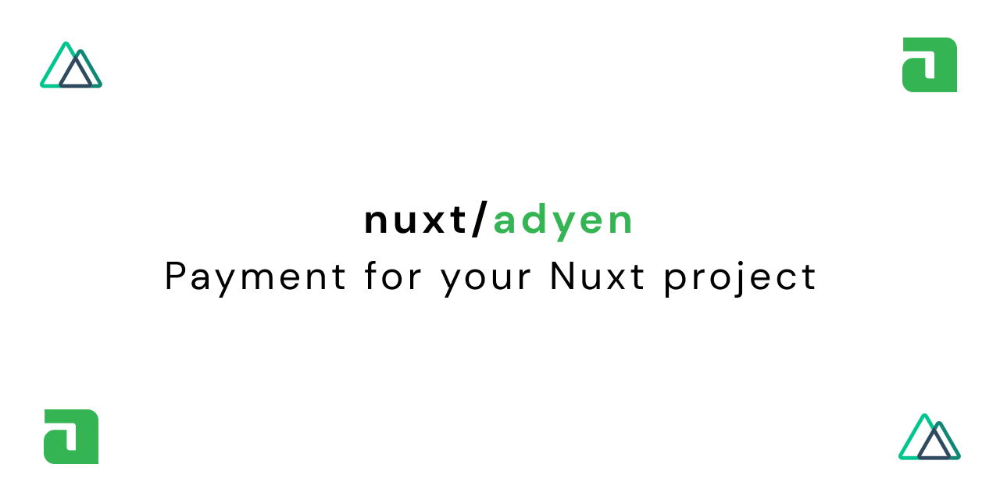

<p align="center">
  
</p>

# nuxt-module-template

[![npm version][npm-version-src]][npm-version-href]
[![npm downloads][npm-downloads-src]][npm-downloads-href]
[![Github Actions CI][github-actions-ci-src]][github-actions-ci-href]
[![Codecov][codecov-src]][codecov-href]
[![License][license-src]][license-href]

> X Module for Nuxt.js

[📖 **Release Notes**](./CHANGELOG.md)

## Setup

1. Add `nuxt-module-template` dependency to your project

```bash
yarn add nuxt-module-template # or npm install nuxt-module-template
```

2. Add `nuxt-module-template` to the `modules` section of `nuxt.config.js`

```js
/// nuxt.config.js
{
  modules: [
    // Simple usage
    'nuxt-module-template',

    // With options
    ['nuxt-module-template', { /* module options */ }]
  ]
}
```

Or a separate section `nuxt-module-template` for module options:

```js
// nuxt.config.js
{
  modules: [
    // Simple usage
    'nuxt-module-template',
  ],
  'nuxt-module-template': {
    /* all other options */
  }
}
```

## Documentation

Move to the `docs` directory:

```bash
cd docs
```

Install dependencies and start the project in development mode:

```bash
yarn && yarn dev
```

## Development

1. Clone this repository
2. Install dependencies using `yarn install` or `npm install`
3. Start development server using `npm run dev`

## License

[MIT License](./LICENSE)

Copyright (c) Baroshem <jakub.andrzejewski.dev@gmail.com>

<!-- Badges -->
[npm-version-src]: https://img.shields.io/npm/v/nuxt-adyen-module/latest.svg
[npm-version-href]: https://npmjs.com/package/nuxt-adyen-module

[npm-downloads-src]: https://img.shields.io/npm/dt/nuxt-adyen-module.svg
[npm-downloads-href]: https://npmjs.com/package/nuxt-adyen-module

[github-actions-ci-src]: https://github.com/baroshem/nuxt-adyen-module/workflows/ci/badge.svg
[github-actions-ci-href]: https://github.com/baroshem/nuxt-adyen-module/actions?query=workflow%3Aci

[codecov-src]: https://img.shields.io/codecov/c/github/baroshem/nuxt-adyen-module.svg
[codecov-href]: https://codecov.io/gh/baroshem/nuxt-adyen-module

[license-src]: https://img.shields.io/npm/l/nuxt-adyen-module.svg
[license-href]: https://npmjs.com/package/nuxt-adyen-module
